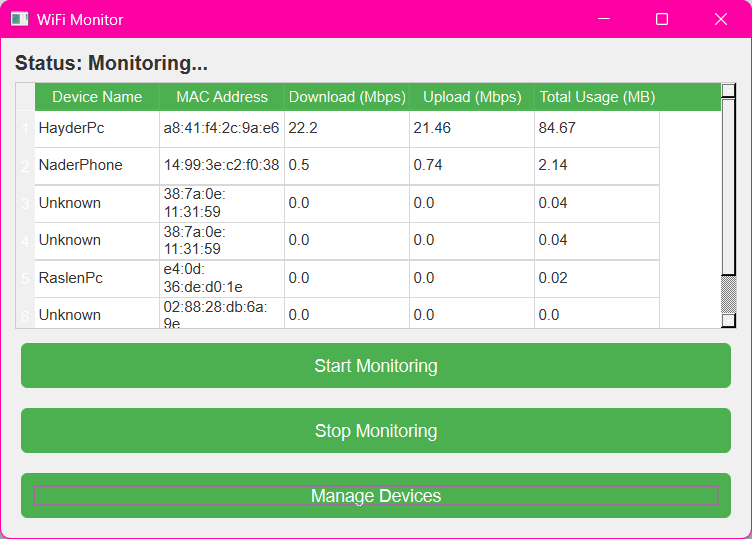

# 🌟 Welcome to **MyLittleProjects**!  

Hey there! 👋  

This is my collection of **small, personal projects**—a mix of things I built for fun, learning, and experimentation. Feel free to **look around, explore, and even use** anything you find interesting!  

## 📌 What You’ll Find Here  
- **Experiments with new technologies**  
- **Projects built to solve small problems**  
- **Code snippets, utilities, and random ideas**  
- **A mix of AI-assisted and self-built work**  

## ⚡ Why This Exists  
I love tinkering with code and trying out **new concepts, libraries, and frameworks**. Some of these projects might be polished, while others are just **rough ideas in progress**. Either way, they’re here to be shared!  

## 💡 Feel Free to Contribute  
If you see something cool and want to improve it, suggest ideas, or just chat about coding—**you're more than welcome to reach out!** 🚀  

### 🛠️ Have Fun Exploring!  
