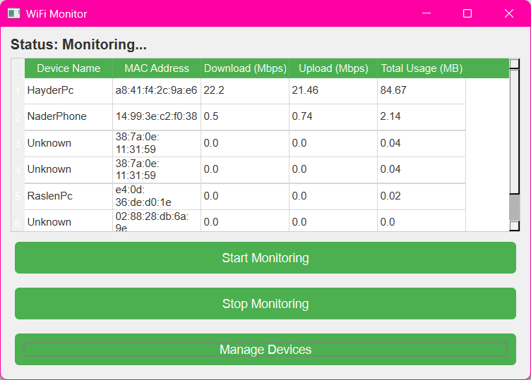

# WiFi Monitoring Tool  

## 📌 About  
This is a **personal project** I built for monitoring my WiFi network usage. Since this is my **first time working with network and HTML request libraries**, I relied heavily on **AI assistance** for implementing the necessary functions. 



The tool is specifically designed for **my router and WiFi setup**, meaning it **won't work on other routers** without modifications. However, **if you'd like to adapt it to your own router, feel free to contact me** for help with implementation!  

## 🚀 Features  
- **Live monitoring** of connected devices and their bandwidth usage.  
- **Displays real-time download/upload speeds** in Mbps.  
- **Tracks total data usage per device.**  
- **GUI built with PyQt6** for an easy-to-use experience.  
- **Device name customization** for better identification.  

## ⚙️ Requirements  
- **Python 3.x**  
- Required libraries:  
  ```sh
  pip install requests beautifulsoup4 PyQt6
  ```

## 🔧 Setup & Usage  
1. **Run the script**  
   ```sh
   python code.py
   ```
2. Click **"Start Monitoring"** to begin tracking network usage.  
3. Use the **Device Manager** to assign custom names to MAC addresses.  

## ⚠️ Limitations  
- Works **only on my specific router** due to the authentication and data-fetching methods.  
- **Not a universal WiFi monitoring tool**—custom modifications are needed for other routers.  

## 📩 Need Help?  
If you'd like to **implement this for your router**, feel free to **contact me**! I'll be happy to assist with adaptation. 🚀  
